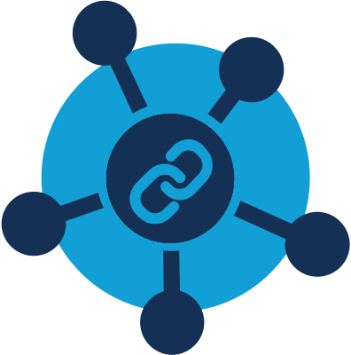

# Riff

[](http://slack.overture.bio)
[](https://github.com/overture-stack/riff/blob/develop/LICENSE)
[](code_of_conduct.md)

<div>

</div>

Riff is a microservice specifically designed for saving and sharing user queries through convenient short URLs. It is simple to use, flexible in storing arbitrary information, and allows for easy collaboration through social channels. 

<!--Blockqoute-->

</br>

> 
> <div>
> 
> </div>
> 
> *Riff is part of [Overture](https://www.overture.bio/) an ecosystem of research software components, each with narrow responsibilities made to connect minds and data.</br></br>*
> 
> 

<!--Blockqoute-->

## Documentation

- *coming soon*
<!--

- See our Developer [wiki](https://github.com/overture-stack/riff/wiki)

-->

## Riff Setup

This Quick Start section is designed to help you get up and running with Riff as quickly and easily as possible.

***Requirements:***

To be run locally or in a docker container an instance of [Ego](https://github.com/overture-stack/ego) is required. Ego will generate authorization tokens and provide the verification key. Ego can be cloned and run locally if no public server is available. 

*Other Requirements:*
- [Java 8 SDK](http://www.oracle.com/technetwork/java/javase/downloads/jdk8-downloads-2133151.html)
- [Maven](https://maven.apache.org/download.cgi)
- [docker](https://www.docker.com/get-docker)


***Configuration:***

1. Configure JWT Verification Key

    - Update **application.yml** by setting the `auth.jwt.publicKeyUrl` to the URL to fetch the JWT verification key. The application will not start if it can't set the verification key for the JWTConverter.
    - The default value in the **application.yml** file is set to connect to EGO running locally on its default port `8081`.

2. Setup the Database
    - Install Postgres
    - Create a Database (Riff with the username `postgres` with the password field empty)
    - For information on managing database migrations [see here](#managing-database-migrations-with-flyway)

***Running Riff:***

There are two ways to run Riff: locally or in a Docker container.

*Run Local*

To run Riff locally, use the command

```bash
mvn spring-boot:run
```

The application will run by default on port `1234`. You can configure the port by changing `server.port` in the `application.yml` file.

*Run Docker*

To run riff in a Docker container, first build the image using the command

```bash
docker-compose build
```

Once the image is built, you can start the container using

```bash
docker-compose up
```

The application will run by default on port 1234. You can configure the port by changing services.api.ports in the docker-compose.yml file. Port 1234 was used by default so the value is easy to identify and change in the configuration file.

### Managing Database Migrations with Flyway

To ensure that the database stays in a consistent state and to handle updates, we use [Flyway](https://flywaydb.org/) for database migration and versioning.

Here's how to set it up:

1. Download the Flyway command-line tool from [here](https://flywaydb.org/download/commandline).
2. Unpack the tool in a directory of your choice.
3. Run the Flyway command-line tool and point it to the configuration and migration directories in this repository.

To check the current version of the database:

```bash
./flyway -configFiles=<path_to_riff>/riff/src/main/resources/flyway/conf/flyway.conf -locations=filesystem:<path_to_riff>/riff/src/main/resources/flyway/sql info
```

To run outstanding migrations:

```bash
./flyway -configFiles=<path_to_riff>/riff/src/main/resources/flyway/conf/flyway.conf -locations=filesystem:<path_to_riff>/riff/src/main/resources/flyway/sql migrate
```

To learn more about the naming conventions used for migrations, [click here](https://flywaydb.org/documentation/concepts/migrations.html).

## Support & Contributions

- Filing an [issue](https://github.com/overture-stack/ego/issues)
- Making a [contribution](CONTRIBUTING.md)
- Connect with us on [Slack](http://slack.overture.bio)
- Add or Upvote a [feature request](https://github.com/overture-stack/ego/issues?q=is%3Aopen+is%3Aissue+label%3Anew-feature+sort%3Areactions-%2B1-desc)

